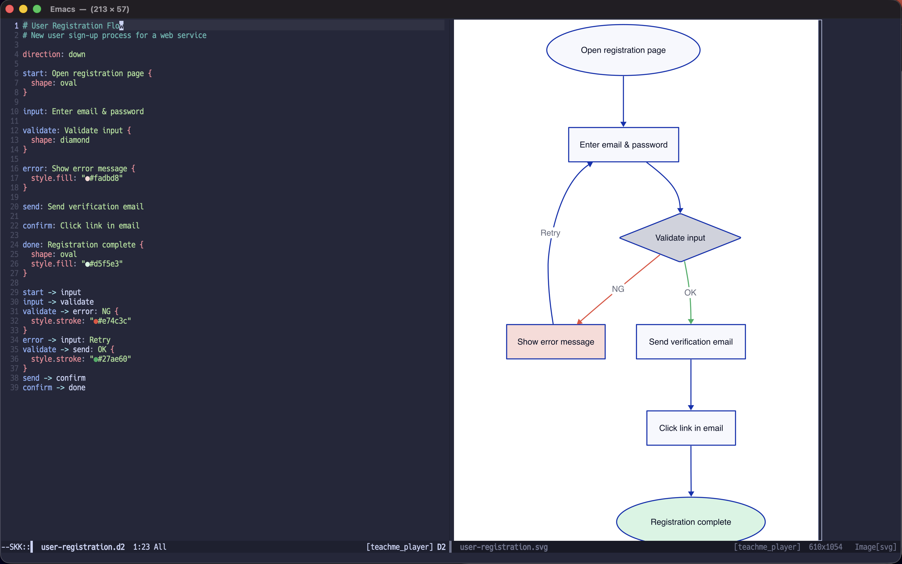

# d2-ts-mode

[](https://github.com/chaploud/d2-ts-mode/actions/workflows/ci.yml)
[](https://melpa.org/#/d2-ts-mode)


A tree-sitter based major mode for editing [D2](https://d2lang.com) diagram files in Emacs 30+.



## Features

| Feature             | Description                                              |
|---------------------|----------------------------------------------------------|
| Syntax highlighting | Full grammar-based via tree-sitter (4 levels, 40+ builtins) |
| Indentation         | AST-based (block / label_codeblock aware)                |
| Imenu               | Categorized navigation (Class, Table, Container, ...)    |
| Comment             | `M-;` comment/uncomment region                           |
| Defun navigation    | `C-M-a` / `C-M-e` between top-level declarations        |
| Compile file        | `C-c C-c` — compile to SVG/PNG/PDF                      |
| Compile buffer      | `C-c C-b` — compile buffer contents                     |
| Compile region      | `C-c C-r` — compile selected region                     |
| Watch / Live reload | `C-c C-w` — `d2 --watch` (browser or Emacs side window) |
| Watch stop          | `C-c C-q` — stop watch process                          |
| Emacs image preview | `C-c C-p` — side window with auto-revert on save        |
| Org-Babel           | `#+begin_src d2 :file out.svg` via `ob-d2.el`           |

### Font-lock levels

Adjust with `treesit-font-lock-level`:

| Level | Features                                              |
|-------|-------------------------------------------------------|
| 1     | Comments, definitions                                 |
| 2     | Keywords, strings, builtins (default)                 |
| 3     | Constants, numbers, escape sequences, variables, imports |
| 4     | Brackets, delimiters, operators, globs, errors        |

## Requirements

- Emacs 30.1 or later with tree-sitter support
- The D2 tree-sitter grammar ([ravsii/tree-sitter-d2](https://github.com/ravsii/tree-sitter-d2))
- A C compiler for building the grammar (cc/gcc/clang)
- [d2 CLI](https://d2lang.com/tour/install) (for compile/watch/preview commands)

## Installation

### use-package + vc (Emacs 30+, no external tools)

```elisp
(use-package d2-ts-mode
  :ensure t
  :vc (:url "https://github.com/chaploud/d2-ts-mode" :rev :newest :branch "main"))
```

### MELPA

Once available on MELPA:

```elisp
(use-package d2-ts-mode
  :ensure t)
```

### straight.el

```elisp
(use-package d2-ts-mode
  :straight (:host github :repo "chaploud/d2-ts-mode"))
```

### Manual

Clone this repository and add it to your `load-path`:

```elisp
(add-to-list 'load-path "/path/to/d2-ts-mode")
(require 'd2-ts-mode)
```

## Grammar Setup

The grammar is automatically installed when you first open a `.d2` file
(controlled by `d2-ts-mode-ensure-grammars`, default `t`).

To manually install or reinstall:

```
M-x d2-ts-mode-reinstall-grammar
```

## Customization

| Variable                      | Default   | Description                                        |
|-------------------------------|-----------|----------------------------------------------------|
| `d2-ts-mode-indent-offset`    | `2`       | Number of spaces per indentation level             |
| `d2-ts-mode-ensure-grammars`  | `t`       | Auto-install grammar if missing                    |
| `d2-ts-mode-d2-executable`    | `"d2"`    | Path to the d2 binary                              |
| `d2-ts-mode-output-format`    | `"svg"`   | Output format: `"svg"`, `"png"`, or `"pdf"`        |
| `d2-ts-mode-compile-flags`    | `nil`     | Extra CLI flags passed to d2 (list of strings)     |
| `d2-ts-mode-watch-method`     | `'emacs`  | `'emacs` or `'browser` — where `C-c C-w` previews |

## Examples

The [examples/](examples/) directory contains sample D2 files:

- `cicd-pipeline.d2` — CI/CD pipeline flowchart with classes and styling
- `oauth2-flow.d2` — OAuth2 authorization code flow (sequence diagram)
- `microservices.d2` — Microservices architecture with containers and message queue
- `mvc-pattern.d2` — MVC pattern class diagram
- `ec-site-er.d2` — E-commerce ER diagram with sql_table shapes

## Related Projects

- [d2-mode](https://github.com/andorsk/d2-mode) — Regex-based major mode for D2 (Emacs 26.1+, no tree-sitter required)

## License

GPL-3.0-or-later
